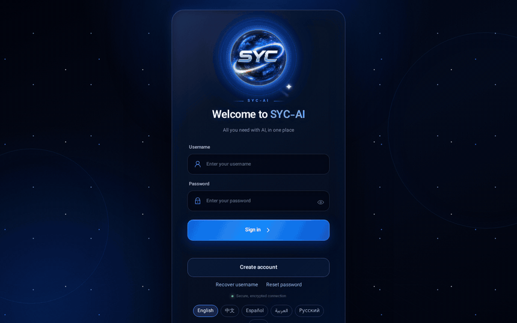

# SYC-AI

### All You Need With AI — In One.

**كل ما تحتاجه من الذكاء الاصطناعي في مكان واحد.**

[English](README.md) · [فارسی](README.fa.md) · [中文](README.zh-CN.md) · [Русский](README.ru.md) · **العربية** · [Español](README.es.md)

[**ابدأ مجانًا ←**](https://app.syc-ai.com/login?lang=ar)

## لماذا SYC-AI

وكلاء البرمجة بالذكاء الاصطناعي أقوياء، لكنهم يعيشون داخل طرفية حاسوب واحد: لا يمكنك بدء جلسة من هاتفك، ولا تعرف متى ينتظر الوكيل موافقتك، ولكل أداة تسجيل دخول وشاشة خاصة بها.

**يجمع SYC-AI كل ذلك في مكان واحد.** اربط حاسوبك مرة واحدة، ثم ابدأ Claude Code وCodex ووجّههما من أي متصفح أو من تطبيق Android أو من سطح المكتب. يخبرك هاتفك عندما يحتاج وكيل إلى موافقتك. تبقى بيانات دخولك وملفاتك على حاسوبك أنت.

## المزايا

مرتبة حسب أكثر ما يطلبه مستخدمو وكلاء الذكاء الاصطناعي.

| | الميزة | ماذا تعني لك |
|---|---|---|
| 📱 | **ابدأ ووجّه من هاتفك** | افتح جلسة جديدة لـ Claude Code أو Codex — لا مجرد مشاهدة — من الويب أو تطبيق Android أو سطح المكتب. |
| 🔔 | **تنبيهات على الهاتف** | يخبرك هاتفك عندما ينتظر وكيل موافقتك أو عندما تنتهي مهمة طويلة. أنت من يفعّلها؛ ولا يُفتح شيء تلقائيًا. |
| 🧩 | **كل الحسابات في مكان واحد** | Claude وCodex يعملان بالكامل اليوم. Gemini وCursor وKimi تُثبَّت على جهازك اليوم، وتسجيل الدخول إليها هو الخطوة التالية. |
| 💻 | **يعمل على حاسوبك أنت** | تُثبَّت أدوات سطر الأوامر للذكاء الاصطناعي بحساباتك على جهازك. تبقى بيانات الدخول والملفات هناك. |
| ✅ | **أنت من يوافق** | تنتظر الأوامر وتغييرات الملفات موافقتك. أنت تقرر كم يُسمح للوكيل أن يفعل وحده. |
| ⚡ | **بلا طرفية** | أمر واحد يربط الحاسوب ويثبّت Node.js إن لم يكن موجودًا. بعدها كل شيء أزرار. |
| 🔀 | **اختر مكان التشغيل** | تعمل كل جلسة على الجهاز الذي تختاره — حاسوبك المحمول أو خادمك أو حاسوب Windows. |
| 📊 | **الاستهلاك لكل رد** | شاهد ما استهلكه كل رد فلا تفاجئك حصتك. |
| 🛡️ | **وكيل جهاز مفتوح المصدر** | [SYC Node](node-agent/) لا يشغّل إلا أدوات الذكاء الاصطناعي، ولا يلمس إلا مجلده، ويسجّل كل طلب، ويمكن إيقافه مؤقتًا في أي وقت. |
| 🔏 | **تحديثات موقّعة مع استرجاع** | لا تثبّت اللوحة وSYC Node إلا الإصدارات الموقّعة من SYC، وتعيدان الإصدار السابق إذا فشل أي فحص. |
| 🌍 | **ست لغات** | English و中文 وEspañol والعربية وРусский وفارسی — اللوحة والمثبّتات وردود الوكلاء. |
| 💬 | **مساعدة حيث تعمل** | التذاكر والإعلانات داخل اللوحة ومرتبطة بحسابك. |

**التالي:** تسجيل الدخول لـ Gemini وCursor وKimi · الاتصالات (Telegram وWhatsApp وInstagram) متصلة بالوكلاء · مساحات عمل للفرق · الإصدارات الاحترافية.

## البدء

حساب واحد وأربع طرق للدخول. أنشئ حسابك في **[app.syc-ai.com](https://app.syc-ai.com/login?lang=ar)** بعنوان Gmail واسم مستخدم وكلمة مرور.

| | أين | كيف |
|---|---|---|
| 🌐 | **الويب** | افتح **[app.syc-ai.com](https://app.syc-ai.com/login?lang=ar)** في أي متصفح. |
| 📱 | **Android** | **[نزّل تطبيق SYC-AI](https://syc-ai.com/download/syc-ai.apk)** (APK) — اللوحة على هاتفك وقناة التنبيهات. |
| 🐧 | **Linux / macOS** | <code dir="ltr">curl -fsSL https://syc-ai.com/node/ar/install.sh &#124; bash</code> |
| 🪟 | **Windows** | <code dir="ltr">irm https://syc-ai.com/node/ar/install.ps1 &#124; iex</code> — وفي Chrome أو Edge يجعل خيار «تثبيت SYC-AI» اللوحة تطبيقًا لسطح المكتب. |

ثم افتح **الحسابات الاحترافية**، واضغط **تثبيت** على Claude أو Codex، و**سجّل الدخول** مرة واحدة في متصفحك. هذا كل شيء.

> هذه روابط تثبيت عربية: يسأل المثبّت عند بدئه «English أم العربية؟». يثبّت Node.js إن لم يكن موجودًا؛ وعند تشغيله بصلاحية root على Linux ينشئ مستخدمًا منفصلًا باسم `syc-node`. أزل كل شيء في أي وقت بالأمر `syc-node uninstall`.

## كيف يعمل

- يتصل حاسوبك **إلى** syc-ai.com؛ لا يُفتح أي منفذ على جهازك ولا حاجة إلى خادم.
- تطلب اللوحة من SYC Node تشغيل أداة الذكاء الاصطناعي المثبّتة، وتتصل الأداة مباشرة بـ Anthropic أو OpenAI بحسابك أنت.
- تمر رسائلك وردود الوكلاء عبر اللوحة وتُحفظ في سجل الجلسة لتكمل من جهاز آخر.

## أين تُحفظ بياناتك

| على حاسوبك | على syc-ai.com | تحت سيطرتك |
|---|---|---|
| تسجيل دخول Claude وOpenAI (تحفظه الأدوات) | حساب SYC-AI (البريد، الاسم، تجزئة كلمة المرور) | `syc-node pause` — لا تستخدم اللوحة الجهاز حتى تستأنف |
| ملفاتك ومشاريعك | سجل الجلسات لتكمل من أي مكان | `syc-node log` — كل طلب أرسلته اللوحة إلى جهازك |
| الأوامر التي ينفذها الوكلاء | أسماء الأجهزة والتنبيهات والتذاكر | `syc-node uninstall` · تنزيل بياناتك من ملفك الشخصي |

التفاصيل: [الخصوصية](https://syc-ai.com/privacy) · [الشروط](https://syc-ai.com/terms).

## SYC Node — الوكيل على جهازك

SYC Node ملف واحد بلا اعتماديات ([`node-agent/syc-node.mjs`](node-agent/syc-node.mjs)): يشغّل **فقط** أدوات الذكاء الاصطناعي (`claude` و`codex` و`gemini` و`cursor-agent` و`kimi` و`qwen`) وتثبيت هذه الحزم نفسها عبر npm ومثبّت Cursor الرسمي، **ويرفض أي برنامج آخر**؛ يقرأ ويكتب **داخل `~/.syc-node` فقط**؛ يحذف أي متغير بيئة قد يوجّه الأداة إلى خادم آخر أو يحمّل شيفرة مسبقًا؛ **يسجّل كل طلب** في `~/.syc-node/activity.log`؛ ولا يحدّث نفسه إلا بإصدارات موقّعة بمفتاح إصدارات SYC.

## الإصدارات

| الإصدار | الحالة |
|---|---|
| **SYC-AI (Main)** | متاح الآن — **مجاني خلال الإطلاق** |
| Plus · Pro · Immortal Edition | قريبًا. يُعرض السعر قبل أي اختيار؛ الدفع غير مفتوح بعد. |

## أسئلة

**هل هو مجاني؟** SYC-AI (Main) مجاني خلال الإطلاق. تأتي الإصدارات المدفوعة لاحقًا ويُعرض سعرها مسبقًا.

**هل أحتاج إلى خادم؟** لا. يكفي حاسوبك المحمول أو المكتبي، ويمكن استخدام خادم أيضًا.

**هل تُرسل شيفرتي إليكم؟** تبقى الملفات على حاسوبك. تمر المحادثة — رسائلك والردود التي قد تقتبس أجزاء من الملفات — عبر syc-ai.com وتُحفظ في سجل الجلسة.

**هل لكم علاقة بـ Anthropic أو OpenAI أو Google؟** لا. SYC-AI منتج مستقل، وتستخدم حساباتك وفق شروط كل مزوّد.

## الاستضافة الذاتية

يثبّت الإصدار المستضاف ذاتيًا اللوحة كاملة على خادم Linux خاص بك — الأمر والمتطلبات في [README الإنجليزي](README.md#self-host).

## المجتمع

الأسئلة والأفكار في [Discussions](https://github.com/SYCC-AI/syc-ai/discussions)، والأخطاء في [Issues](https://github.com/SYCC-AI/syc-ai/issues)، والبريد syc@syc-ai.com.

إن سهّل SYC-AI عملك، فنجمة ⭐ تساعد الآخرين على العثور عليه.

## الترخيص

الشيفرة المصدرية متاحة (source-available) بموجب [Business Source License 1.1](LICENSE). `SYC` و`SYC-AI` علامتان تجاريتان لـ SYC.

