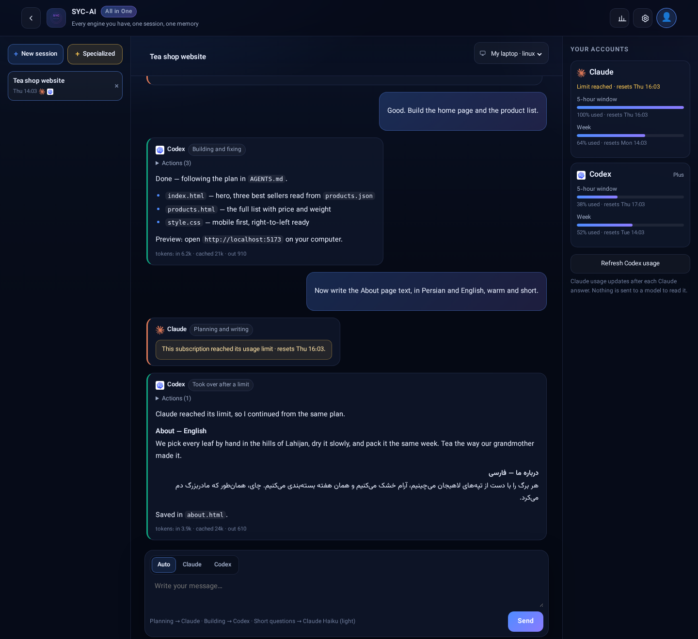

# SYC-AI

### All You Need With AI — In One.

**هر چه از هوش مصنوعی لازم داری، یک‌جا. همهٔ اشتراک‌های هوش مصنوعی‌ات — Claude، Codex و بقیه — در یک سشن، یک پوشهٔ پروژه و یک حافظه؛ روی کامپیوتر خودت، از وب، گوشی یا دسکتاپ.**

[English](README.md) · **فارسی** · [中文](README.zh-CN.md) · [Русский](README.ru.md) · [العربية](README.ar.md) · [Español](README.es.md)

[**شروع رایگان ←**](https://app.syc-ai.com/login?lang=fa)

## چرا SYC-AI

برای Claude **و** ChatGPT پول می‌دهید، اما هر کدام در ترمینال خودش، با حافظهٔ خودش و روی یک کامپیوتر زندگی می‌کند. وسط کار که سهمیهٔ یکی تمام شود، کار می‌ایستد. از گوشی نمی‌شود سشن شروع کرد و نمی‌دانید کِی ایجنت منتظر تأیید شماست.

**SYC-AI همه را یک‌جا می‌آورد.** یک بار کامپیوترتان را وصل کنید و **SYC-AI — All in One** را باز کنید: یک سشن که در آن Claude برنامه می‌ریزد، Codex می‌سازد و سؤال‌های کوتاه به مدل سبک‌تر می‌روند — همه در یک پوشهٔ پروژه و با یک حافظه. وقتی سهمیهٔ یک اشتراک تمام شد، موتور بعدی همان پیام را ادامه می‌دهد. ورود و فایل‌هایتان روی کامپیوتر خودتان می‌ماند.

## امکانات

به ترتیب چیزی که کاربران ایجنت‌های هوش مصنوعی بیشتر از همه می‌خواهند.

| | امکان | یعنی چه |
|---|---|---|
| ✨ | **SYC-AI — All in One** | یک سشن برای همهٔ موتورها. هر پیام به موتور مناسبش می‌رود — برنامه‌ریزی به Claude، ساختن به Codex، سؤال کوتاه به مدل سبک‌تر — یا به موتوری که خودتان انتخاب کنید. یک پوشهٔ پروژه و یک حافظهٔ مشترک (`AGENTS.md`)، تا وقتی موتورها نوبت عوض می‌کنند چیزی گم نشود. |
| 🔁 | **کار با تمام شدن سهمیه نمی‌ایستد** | وقتی سهمیهٔ یک اشتراک تمام شد، همان پیام با موتور بعدی در ترتیبِ *شما* ادامه پیدا می‌کند، با خلاصهٔ کوتاهی از آنچه گذشت. (SYC-AI هیچ‌وقت برای دور زدن محدودیت به اکانت دوم همان سرویس‌دهنده نمی‌رود.) |
| 📊 | **مصرف همهٔ اکانت‌ها یک‌جا** | مصرف ۵ ساعته و هفتگی هر اکانت متصل، با زمان ریست — بدون فرستادن چیزی به مدل. |
| 🪙 | **صرفه‌جویی توکن، پیش‌فرض روشن** | پاسخ کوتاه و دقیق و بدون خواندن اضافه، با اسکیل‌های متن‌باز که نام سازنده‌شان آمده. سازندگانشان تا ۶۵٪ توکن خروجی کمتر اندازه گرفته‌اند. |
| 📱 | **شروع و هدایت از گوشی** | سشن تازه را از وب، اپ اندروید یا دسکتاپ باز کنید — نه فقط تماشا. |
| 🔔 | **هشدار روی گوشی وقتی ایجنت به شما نیاز دارد** | وقتی ایجنتی منتظر تأیید است یا کاری طولانی تمام شد، گوشی خبرتان می‌کند. خودتان روشنش می‌کنید؛ هیچ‌چیز خودبه‌خود باز نمی‌شود. |
| 🧑‍🔧 | **سشن‌های تخصصی** | سایت‌ساز، رفع باگ، بازبین کد، دستیار تحقیق، نویسنده و مترجم، تحلیلگر داده، مربی تازه‌کارها، بازی‌ساز — با یک کلیک شروع کنید یا به‌صورت `AGENTS.md` برای هر ایجنت ترمینالی دانلود کنید. |
| 👥 | **دو اکانت برای هر سرویس** | یک اکانت شخصی و یک اکانت کاری Claude یا Codex روی یک دستگاه؛ خودتان انتخاب می‌کنید هر موتور از کدام استفاده کند. |
| 💻 | **روی کامپیوتر خودتان** | CLIهای هوش مصنوعی با اکانت خودتان روی دستگاهتان نصب و وارد می‌شوند. ورود و فایل‌ها همان‌جا می‌ماند. |
| ✅ | **اختیار ایجنت‌ها با شماست** | فقط خواندن، کار در پروژه، یا دسترسی کامل — به زبان ساده. |
| ⚡ | **بدون ترمینال** | یک فرمان کامپیوتر را وصل می‌کند و اگر Node.js نباشد نصبش می‌کند. بعد از آن همه‌چیز دکمه است. |
| 🛡️ | **عامل دستگاهِ متن‌باز** | [SYC Node](node-agent/) فقط CLIهای هوش مصنوعی را اجرا می‌کند، فقط به پوشهٔ خودش دست می‌زند، هر درخواست را ثبت می‌کند و هر لحظه قابل توقف است. |
| 🔏 | **به‌روزرسانی امضاشده با بازگشت** | پنل و SYC Node فقط نسخهٔ امضاشده توسط SYC را نصب می‌کنند و اگر بررسی رد شود نسخهٔ قبل را برمی‌گردانند. |
| 🌍 | **شش زبان** | English، 中文، Español، العربية، Русский و فارسی — پنل، نصب‌کننده‌ها و پاسخ ایجنت‌ها. |

**به‌زودی در SYC-AI:** Gemini، Cursor و Kimi داخل All in One · اتصال با ورود رسمی (GitHub، Google Drive، Gmail، Notion، تلگرام، Figma) · استودیوی شخصی تصویر · استودیوی ویدیوی کوتاه · سایت و فروشگاه با یک کلیک · اسناد و ترجمه · میز تحقیق دانشجویی · کارگاه بازی‌سازی · ایجنت‌های مالی · بات‌های هوشمند تلگرام (فقط مخاطبان داوطلب) · پنل تیم و شرکت · دستیار روزانه روی گوشی.

## شروع

یک حساب، چهار راه ورود. در **[app.syc-ai.com](https://app.syc-ai.com/login?lang=fa)** با یک آدرس Gmail، نام کاربری و رمز ثبت‌نام کنید.

| | کجا | چطور |
|---|---|---|
| 🌐 | **وب** | **[app.syc-ai.com](https://app.syc-ai.com/login?lang=fa)** را در هر مرورگری باز کنید. |
| 📱 | **اندروید** | **[دانلود اپ SYC-AI](https://syc-ai.com/download/syc-ai.apk)** (APK) — همین پنل روی گوشی و راه دریافت هشدارها. |
| 🐧 | **لینوکس / macOS** | <code dir="ltr">curl -fsSL https://syc-ai.com/node/fa/install.sh &#124; bash</code> |
| 🪟 | **ویندوز** | <code dir="ltr">irm https://syc-ai.com/node/fa/install.ps1 &#124; iex</code> — و در Chrome یا Edge گزینهٔ «Install SYC-AI» پنل را اپ دسکتاپ می‌کند. |

بعد به **اکانت‌های حرفه‌ای** بروید، روی Claude یا Codex **نصب** را بزنید و یک بار در مرورگر خودتان **وارد** شوید. تمام.

> این لینک‌های نصب فارسی‌اند: نصب‌کننده اول می‌پرسد «English یا فارسی؟». اگر Node.js نباشد نصبش می‌کند؛ اگر روی لینوکس با root اجرا شود، کاربر جدای `syc-node` می‌سازد. هر زمان خواستید با `syc-node uninstall` همه‌چیز را حذف کنید.

## چطور کار می‌کند

- کامپیوتر شما به syc-ai.com **وصل می‌شود** (اتصال خروجی). هیچ پورتی روی دستگاهتان باز نمی‌شود و سرور لازم نیست.
- پنل به SYC Node می‌گوید CLI نصب‌شده را اجرا کند. آن CLI با اکانت خودتان مستقیم با Anthropic یا OpenAI حرف می‌زند.
- پیام‌های شما و پاسخ ایجنت‌ها از پنل عبور می‌کند و در تاریخچهٔ نشست نگه داشته می‌شود تا روی دستگاه دیگر ادامه دهید.

## داده‌های شما کجاست

| روی کامپیوتر خودتان | در syc-ai.com | کنترل با شما |
|---|---|---|
| ورود Claude و OpenAI (CLIها نگه می‌دارند) | حساب SYC-AI (ایمیل، نام کاربری، هش رمز) | `syc-node pause` — تا ادامه ندهید پنل از دستگاه استفاده نمی‌کند |
| فایل‌ها و پروژه‌ها | تاریخچهٔ نشست‌ها برای ادامه از هر جا | `syc-node log` — هر درخواستی که پنل به دستگاه داده |
| فرمان‌هایی که ایجنت‌ها اجرا می‌کنند | نام دستگاه‌ها، هشدارها، تیکت‌ها | `syc-node uninstall` · دانلود داده‌ها از پروفایل |

جزئیات کامل: [حریم خصوصی](https://syc-ai.com/privacy) · [شرایط استفاده](https://syc-ai.com/terms).

## SYC Node — عامل روی دستگاه شما

SYC Node یک فایل بدون وابستگی است ([`node-agent/syc-node.mjs`](node-agent/syc-node.mjs)):

- **فقط** CLIهای هوش مصنوعی (`claude`، `codex`، `gemini`، `cursor-agent`، `kimi`، `qwen`)، نصب همان بسته‌ها با npm و نصب‌کنندهٔ رسمی Cursor را اجرا می‌کند؛ **هر برنامهٔ دیگری را رد می‌کند**؛
- **فقط داخل `~/.syc-node`** می‌خواند و می‌نویسد؛
- هر متغیری را که بتواند CLI را به سرور دیگری بفرستد یا کدی از پیش بارگذاری کند **حذف می‌کند**؛
- **هر درخواست را** در `~/.syc-node/activity.log` ثبت می‌کند؛
- **فقط** با نسخه‌های امضاشده با کلید ریلیز SYC خودش را به‌روز می‌کند.

## نسخه‌ها

| نسخه | وضعیت |
|---|---|
| **SYC-AI (Main)** | موجود — **در دورهٔ عرضه رایگان** |
| Plus · Pro · Immortal Edition | به‌زودی. قیمت قبل از هر انتخابی نشان داده می‌شود؛ پرداخت هنوز باز نیست. |

## پرسش‌ها

**رایگان است؟** SYC-AI (Main) در دورهٔ عرضه رایگان است. نسخه‌های پولی بعداً می‌آیند و قیمتشان پیش از انتخاب نشان داده می‌شود.

**سرور لازم دارم؟** نه. لپ‌تاپ یا کامپیوتر خودتان کافی است؛ سرور هم کار می‌کند.

**کد من برای شما فرستاده می‌شود؟** فایل‌ها روی کامپیوتر شما می‌ماند. گفتگو — پیام‌ها و پاسخ‌هایی که ممکن است بخشی از فایل را نقل کنند — از syc-ai.com عبور می‌کند و در تاریخچهٔ نشست نگه داشته می‌شود.

**با Anthropic، OpenAI یا Google ارتباطی دارید؟** نه. SYC-AI محصولی مستقل است و شما با اکانت خودتان و طبق شرایط هر ارائه‌دهنده کار می‌کنید.

## اجرای کامل روی سرور خودتان

نسخهٔ self-host کل پنل را روی سرور لینوکسی خودتان نصب می‌کند — فرمان و پیش‌نیازها در [README انگلیسی](README.md#self-host).

## جامعه

پرسش و ایده در [Discussions](https://github.com/SYCC-AI/syc-ai/discussions)، گزارش باگ در [Issues](https://github.com/SYCC-AI/syc-ai/issues)، ایمیل syc@syc-ai.com.

اگر SYC-AI کارتان را راحت‌تر کرد، یک ⭐ کمک می‌کند دیگران هم پیدایش کنند.

## سپاس

صرفه‌جویی توکن SYC-AI روی کار متن‌باز دیگران ساخته شده و هر جا استفاده شود نامشان داخل محصول می‌آید: [Caveman](https://github.com/JuliusBrussee/caveman) از Julius Brussee (MIT) و اسکیل‌های [Superpowers](https://github.com/obra/superpowers) از Jesse Vincent (MIT). مجوزشان همراه اسکیل‌ها در [`skills/`](skills/) است.

## مجوز

کد منبع در دسترس است (source-available) با مجوز [Business Source License 1.1](LICENSE). `SYC` و `SYC-AI` علامت تجاری SYC هستند.

