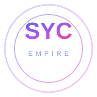
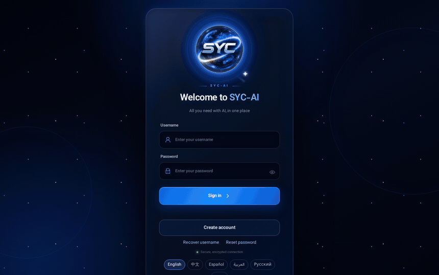
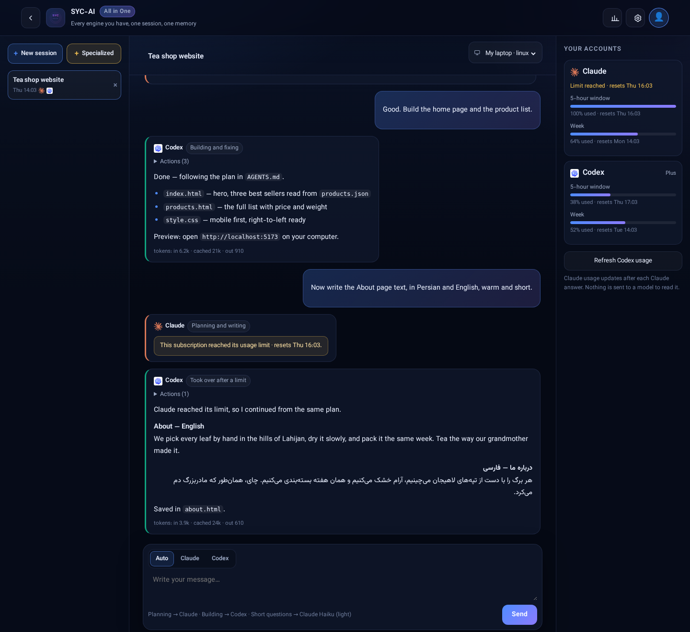

# SYC-AI

### Claude Code و Codex در یک گفت‌وگو. سهمیهٔ یکی که تمام شد، دیگری ادامه می‌دهد.

یک پوشهٔ پروژه، یک حافظه؛ با دو اشتراکی که خودتان دارید، روی گوشی اندروید یا کامپیوتر ویندوزی خودتان. 
به شش زبان.

[English](README.md) · **فارسی** · [中文](README.zh-CN.md) · [Русский](README.ru.md) · [العربية](README.ar.md) · [Español](README.es.md)

- **تازه: Free Professional — رایگان برای همه.** بدون اشتراک، بدون کلید API.
  - حدود ۶۰ مدل هوش مصنوعی رایگان در یک جلسهٔ برنامه‌نویسی، که هر روز تست و رتبه‌بندی می‌شوند. کار با قوی‌ترین شروع می‌شود و وقتی سهم رایگانش تمام شد، مدل بعدی در همان فایل‌ها ادامه می‌دهد.
  - خودتان هر مدلی را انتخاب کنید، یا بگذارید Claude یا Codex فقط طرح را بنویسد و مدل‌های رایگان کار را انجام دهند؛ پیشرفت را زنده می‌بینید («قدم ۳ از ۸»). [چطور کار می‌کند ←](https://syc-ai.com/free-professional/)
- **یک گفت‌وگو، دو موتور.**
  - Claude برنامه می‌ریزد، Codex می‌سازد و سؤال‌های کوتاه به یک مدل سبک‌تر می‌روند؛ همه در یک پوشه و با یک `AGENTS.md` مشترک.
  - اگر سهمیهٔ یک اشتراک تمام شود، همان پیام با موتور *دیگرِ* شما ادامه پیدا می‌کند، همراه با خلاصه‌ای از آنچه گذشته است.
  - هیچ‌وقت سراغ اکانت دومِ همان سرویس‌دهنده نمی‌رود.
- **لازم نیست چیزی را دستی راه بیندازید.**
  - اپ اندروید و اپ ویندوز، Claude Code و Codex را همراه خود دارند.
  - دستگاه با کدی که تأیید می‌کنید به حسابتان وصل می‌شود؛ روی گوشی خودبه‌خود.
  - ورود به Claude و Codex را خودتان در مرورگر خودتان انجام می‌دهید.
- **ببینید چقدر مصرف می‌کنید.**
  - مصرف ۵ ساعته و هفتگی هر اکانت
  - «دکتر توکن»
  - هشدار پیش از ادامهٔ یک گفت‌وگوی «سرد» و پرهزینه
  - همهٔ این‌ها بدون فرستادن حتی یک پیام به مدل

**دریافت:** [ثبت‌نام رایگان](https://app.syc-ai.com/login?lang=fa) (با Google، GitHub یا Gmail) ← اندروید: [**syc-ai.apk**](https://syc-ai.com/download/syc-ai.apk) · ویندوز: [**SYC-AI-Setup.exe**](https://syc-ai.com/download/SYC-AI-Setup.exe)

SYC-AI محصولی مستقل از SYC است و وابستگی‌ای به Anthropic یا OpenAI ندارد. شما با اکانت‌های خودتان و طبق قوانین هر سرویس‌دهنده کار می‌کنید. CLIهای رسمی، دست‌نخورده، روی دستگاه خودتان اجرا می‌شوند.

## امکانات

| | امکان | یعنی چه |
|---|---|---|
| ✨ | **SYC-AI — All in One** | یک سشن برای Claude و Codex. هر پیام به موتور مناسبش می‌رود — برنامه‌ریزی به Claude، ساختن به Codex، سؤال کوتاه به مدل سبک‌تر — یا به موتوری که خودتان انتخاب کنید. یک پوشهٔ پروژه و یک حافظهٔ مشترک (`AGENTS.md`)، تا وقتی موتورها نوبت عوض می‌کنند چیزی گم نشود. |
| 🆓 | **Free Professional — رایگان برای همه** | حدود ۶۰ مدل هوش مصنوعی رایگان که هر روز تست و رتبه‌بندی می‌شوند، در یک جلسهٔ برنامه‌نویسی روی دستگاه خودتان: قوی‌ترین شروع می‌کند و وقتی سهم رایگانش تمام شد، بعدی ادامه می‌دهد. هر مدلی را خودتان انتخاب کنید، یا بگذارید Claude یا Codex فقط طرح را بنویسد و مدل‌های رایگان قدم‌به‌قدم بسازند. بدون اشتراک و بدون کلید API؛ سقف استفادهٔ منصفانه ۸۰۰ درخواست در روز. |
| 🔁 | **کار با تمام شدن سهمیه نمی‌ایستد** | وقتی سهمیهٔ یک اشتراک تمام شد، همان پیام با موتور بعدی در ترتیبِ *شما* ادامه پیدا می‌کند، با خلاصهٔ کوتاهی از آنچه گذشت. (SYC-AI هیچ‌وقت برای دور زدن محدودیت به اکانت دوم همان سرویس‌دهنده نمی‌رود.) |
| 📊 | **مصرف همهٔ اکانت‌ها یک‌جا** | مصرف ۵ ساعته و هفتگی هر اکانت متصل، با زمان ریست — بدون فرستادن چیزی به مدل. |
| 🩺 | **دکتر توکن و هشدار گفت‌وگوی سرد** | معاینه‌ای از اینکه گفت‌وگوهایتان در Claude و Codex توکن را کجا خرج می‌کنند — درصد استفاده از کش، گفت‌وگوهایی که کششان منقضی شده، بخش ثابت هر سؤال — با توصیه‌های ساده. اگر بعد از یک ساعت یا بیشتر سراغ یک گفت‌وگوی طولانی بروید، SYC-AI هشدار می‌دهد که پیام بعدی کل آن را با قیمت کامل دوباره می‌خواند. هیچ‌کدام از مدل چیزی نمی‌پرسد. |
| 🪙 | **صرفه‌جویی توکن، پیش‌فرض روشن** | پاسخ کوتاه و دقیق و بدون خواندن اضافه، با اسکیل‌های متن‌باز که نام سازنده‌شان آمده (Caveman، Superpowers). |
| 📱 | **اپ اندروید با Claude Code و Codex** | ایجنت‌ها روی خود گوشی اجرا می‌شوند. اپ در اولین اجرا CLIهای رسمی و دست‌نخورده را در فضایی خصوصی راه می‌اندازد و گوشی را به حسابتان وصل می‌کند. ورود با Google یا GitHub داخل خود اپ. |
| 🪟 | **اپ ویندوز با Claude Code و Codex** | یک Setup.exe، بدون دسترسی مدیر: Node.js، SYC Node، Claude Code و Codex در یک دانلود. کامپیوتر با کدی که تأیید می‌کنید وصل می‌شود — هیچ رمز SYC-AI روی دستگاه تایپ نمی‌شود. |
| 🔔 | **هشدار وقتی ایجنت به شما نیاز دارد** | وقتی ایجنتی منتظر تأیید است یا کاری طولانی تمام شد، گوشی خبرتان می‌کند. خودتان روشنش می‌کنید؛ هیچ‌چیز خودبه‌خود باز نمی‌شود. |
| 🧑‍🔧 | **سشن‌های تخصصی** | سایت‌ساز، رفع باگ، بازبین کد، دستیار تحقیق، نویسنده و مترجم، تحلیلگر داده، مربی تازه‌کارها، بازی‌ساز — با یک کلیک شروع کنید یا به‌صورت `AGENTS.md` برای هر ایجنت ترمینالی دانلود کنید. |
| 👥 | **دو اکانت برای هر سرویس** | یک اکانت شخصی و یک اکانت کاری Claude یا Codex روی یک دستگاه؛ خودتان انتخاب می‌کنید هر موتور از کدام استفاده کند. |
| ✅ | **اختیار ایجنت‌ها با شماست** | فقط خواندن، کار در پروژه، یا دسترسی کامل — برای هر سشن، به زبان ساده. |
| 🛡️ | **عامل دستگاهِ متن‌باز** | [SYC Node](node-agent/) فقط CLIهای هوش مصنوعی را اجرا می‌کند، فقط به پوشهٔ خودش دست می‌زند، هر درخواست را ثبت می‌کند و هر لحظه قابل توقف است. فایل‌های تنظیمات خود SYC-AI روی دستگاه امضا شده‌اند و اگر تغییر کنند برگردانده می‌شوند. |
| 🔏 | **به‌روزرسانی امضاشده با بازگشت** | پنل و SYC Node فقط نسخهٔ امضاشده توسط SYC را نصب می‌کنند و اگر بررسی رد شود نسخهٔ قبل را برمی‌گردانند. |
| 🌍 | **شش زبان** | English، 中文، Español، العربية، Русский و فارسی — پنل، اپ‌ها و پاسخ ایجنت‌ها. |

**موتورهای امروز:** Claude Code و Codex تست شده‌اند و در همهٔ سشن‌ها کار می‌کنند. به Gemini، Cursor و Kimi هم از همین حالا می‌توانید روی دستگاهتان وارد شوید؛ پنل گفت‌وگویشان به‌زودی می‌آید. Qwen به‌زودی.

## مقایسهٔ منصفانه

| | **SYC-AI** | Anthropic Remote Control | Happy | Paseo | CloudCLI |
|---|---|---|---|---|---|
| ایجنت‌ها | Claude Code + Codex (Gemini، Cursor، Kimi: ورود فعال، گفت‌وگو به‌زودی) | Claude Code | Claude Code، Codex | Claude Code، Codex، Copilot، OpenCode، Pi | Claude Code، Cursor CLI، Codex |
| یک گفت‌وگوی مشترک بین دو موتور، با یک حافظه | **بله** (All in One) | — (یک موتور) | اعلام نشده | اعلام نشده (یک رابط، ایجنت‌های جدا) | اعلام نشده |
| ادامه با موتور دیگر وقتی سهمیهٔ یک اشتراک تمام شد | **بله**، فقط با سرویس‌دهندهٔ دیگر، هرگز با اکانت دوم همان سرویس | — | اعلام نشده | اعلام نشده | اعلام نشده |
| CLIهای ایجنت را برایتان نصب می‌کند | **بله** (داخل اپ اندروید و ویندوز) | Claude Code را خودتان نصب می‌کنید | CLI را خودتان نصب می‌کنید، بعد `npm i -g happy` | CLI پیش‌نیاز است | از سشن‌های CLI موجود شما استفاده می‌کند |
| گوشی | اپ اندروید (APK) که Claude Code و Codex را روی خود گوشی اجرا می‌کند. هنوز iOS ندارد | اپ Claude، iOS و اندروید | iOS، اندروید، وب | iOS، اندروید | مرورگر |
| هشدار وقتی ایجنت به شما نیاز دارد | بله (با انتخاب شما) | بله (push) | بله (push) | در README نیامده | در README نیامده |
| گفت‌وگو از کجا عبور می‌کند | syc-ai.com (در تاریخچهٔ نشست نگه داشته می‌شود؛ رمزنگاری سرتاسری ندارد) | Anthropic | رله با رمزنگاری سرتاسری | daemon خودتان؛ رلهٔ E2E اختیاری | دستگاه خودتان (یا Cloud آن‌ها) |
| حساب لازم است؟ | بله (Google، GitHub یا Gmail) | اشتراک Claude | — | ورود اجباری ندارد | نه (self-hosted) |
| مجوز | BSL 1.1 (source-available؛ کد SYC Node در مخزن) | اختصاصی | MIT | Apache-2.0 | AGPL-3.0 |
| قیمت | Main تا ۳۱ دسامبر ۲۰۲۶ رایگان، بعد ماهی ۱٫۷۵ دلار | در پلن‌های Claude | رایگان | رایگان | self-hosted رایگان؛ Cloud از ۷ یورو در ماه |

«اعلام نشده» یعنی README آن پروژه (خوانده‌شده در ۲۵ سپتامبر ۲۰۲۶) چنین چیزی نمی‌گوید؛ به این معنا نیست که ناممکن است. اصلاحیه‌ها را در [Issues](https://github.com/SYCC-AI/syc-ai/issues) بفرستید.

## شروع

۱. **ثبت‌نام** در **[app.syc-ai.com](https://app.syc-ai.com/login?lang=fa)** با Google، با GitHub، یا با یک آدرس Gmail و رمز. حساب‌های SYC-AI بر پایهٔ Gmail هستند: برای ورود با GitHub، اکانت GitHub شما باید یک آدرس Gmail تأییدشده داشته باشد.

۲. **دریافت اپ:**

| | کجا | چطور |
|---|---|---|
| 📱 | **اندروید** | **[دانلود syc-ai.apk](https://syc-ai.com/download/syc-ai.apk)** (هنوز در Google Play نیست؛ اندروید پس از تأیید شما نصبش می‌کند). بازش کنید و وارد شوید. در اولین اجرا Claude Code و Codex را روی گوشی راه می‌اندازد — چند دقیقه — و گوشی را خودش به حسابتان وصل می‌کند. |
| 🪟 | **ویندوز (x64)** | **[دانلود SYC-AI-Setup.exe](https://syc-ai.com/download/SYC-AI-Setup.exe)** و اجرای آن. دسترسی مدیر (Administrator) لازم نیست. یک کد کوتاه و یک لینک نشان می‌دهد: لینک را هر جا که در SYC-AI وارد شده‌اید باز کنید — روی همان کامپیوتر یا روی گوشی — و ظرف ۱۰ دقیقه **اتصال این دستگاه** را بزنید. |
| 🌐 | **وب** | **[app.syc-ai.com](https://app.syc-ai.com/login?lang=fa)** در هر مرورگر پروفایل، پلن و وضعیت دستگاه‌هایتان را نشان می‌دهد. برای وصل کردن Claude و Codex به اپ اندروید یا ویندوز نیاز دارید. |

۳. **ورود به Claude و Codex.** در **اکانت‌های حرفه‌ای** روی هر موتور **ورود** را بزنید و یک بار در مرورگر خودتان وارد شوید. بعد **SYC-AI — All in One** را باز کنید و کار را شروع کنید.

> Setup.exe ویندوز هنوز امضای کد (code signing) ندارد، پس ممکن است Windows SmartScreen تأیید بخواهد (**More info ← Run anyway**). هر وقت خواستید از **Apps & features** حذفش کنید.

## چطور کار می‌کند

- دستگاه شما به syc-ai.com **وصل می‌شود** (اتصال خروجی). هیچ پورتی روی آن باز نمی‌شود و سرور لازم نیست ([کد عامل را بخوانید](node-agent/syc-node.mjs)).
- پنل به SYC Node می‌گوید CLI نصب‌شده روی دستگاهتان را اجرا کند. آن CLI با اکانت خودتان مستقیم با Anthropic یا OpenAI حرف می‌زند.
- پیام‌های شما و پاسخ ایجنت‌ها از پنل عبور می‌کند و در تاریخچهٔ نشست نگه داشته می‌شود تا روی دستگاه دیگر ادامه دهید. این پیام‌ها رمزنگاری سرتاسری (end-to-end) ندارند.

## داده‌های شما کجاست

| روی دستگاه خودتان | در syc-ai.com | کنترل با شما |
|---|---|---|
| ورود Claude و OpenAI (CLIها نگه می‌دارند) | حساب SYC-AI (ایمیل، نام کاربری، هش رمز) | توقف SYC Node — تا ادامه ندهید پنل از دستگاه استفاده نمی‌کند |
| فایل‌ها و پروژه‌ها | تاریخچهٔ نشست‌ها برای ادامه از هر جا | گزارش فعالیت — هر درخواستی که پنل به دستگاه داده |
| فرمان‌هایی که ایجنت‌ها اجرا می‌کنند | نام دستگاه‌ها، هشدارها، تیکت‌ها | حذف در هر زمان · دانلود داده‌ها از پروفایل |

جزئیات کامل: [حریم خصوصی](https://syc-ai.com/privacy) · [شرایط استفاده](https://syc-ai.com/terms).

## SYC Node — عامل روی دستگاه شما

SYC Node یک فایل بدون وابستگی است ([`node-agent/syc-node.mjs`](node-agent/syc-node.mjs)) که داخل اپ اندروید و ویندوز قرار دارد:

- **فقط** CLIهای هوش مصنوعی (`claude`، `codex`، `gemini`، `cursor-agent`، `kimi`، `qwen`)، نصب همان بسته‌ها با npm در `~/.syc-node/npm` و نصب‌کنندهٔ رسمی Cursor را اجرا می‌کند؛ **هر برنامهٔ دیگری را رد می‌کند**؛
- **فقط داخل `~/.syc-node`** می‌خواند و می‌نویسد؛
- هر متغیری را که بتواند CLI را به سرور دیگری بفرستد یا کدی از پیش بارگذاری کند **حذف می‌کند**؛
- **امضای** هر فایل تنظیماتی را که می‌نویسد بررسی می‌کند و فایل تغییرکرده را برمی‌گرداند؛
- **هر درخواست را** در `~/.syc-node/activity.log` ثبت می‌کند؛
- **فقط** با نسخه‌های امضاشده با کلید ریلیز SYC خودش را به‌روز می‌کند.

## شش زبان

پنل، اپ‌ها و پاسخ ایجنت‌ها به **English، 中文، Español، العربية، Русский و فارسی** هستند. اپ‌ها از زبان گوشی یا ویندوز شما پیروی می‌کنند.

## نسخه‌ها

| نسخه | وضعیت |
|---|---|
| **SYC-AI (Main)** | موجود — **تا ۳۱ دسامبر ۲۰۲۶ رایگان**، بعد ماهی ۱٫۷۵ دلار |
| Plus · Pro · Immortal Edition | به‌زودی (ماهی ۴، ۱۵ و ۹۰ دلار). قیمت قبل از هر انتخابی نشان داده می‌شود؛ پرداخت هنوز باز نیست. |

## به‌زودی

گفت‌وگو با Gemini، Cursor، Kimi و Qwen داخل SYC-AI · اتصال با ورود رسمی (GitHub، Google Drive، Gmail، Notion، تلگرام، Figma) · استودیوی شخصی تصویر · استودیوی ویدیوی کوتاه · سایت و فروشگاه با یک کلیک · اسناد و ترجمه · میز تحقیق دانشجویی · کارگاه بازی‌سازی · ایجنت‌های مالی · بات‌های هوشمند تلگرام (فقط مخاطبان داوطلب) · پنل تیم و شرکت · دستیار روزانه روی گوشی.

## پرسش‌ها

**رایگان است؟** SYC-AI (Main) تا ۳۱ دسامبر ۲۰۲۶ رایگان است و بعد از آن ماهی ۱٫۷۵ دلار. نسخه‌های پولی بعداً می‌آیند و قیمتشان پیش از انتخاب نشان داده می‌شود؛ پرداخت هنوز باز نیست.

**سرور لازم دارم؟** نه. گوشی اندروید یا کامپیوتر ویندوزی خودتان کافی است.

**اول باید Claude Code یا Codex را نصب کنم؟** نه. هر دو داخل اپ اندروید و اپ ویندوز هستند. فقط یک بار از داخل پنل وارد اکانت‌های Claude و ChatGPT خودتان می‌شوید.

**در مرورگر چه کاری می‌شود کرد؟** پنل وب پروفایل، پلن و ارتقا، و وضعیت دستگاه‌هایتان را نشان می‌دهد. کار با Claude و Codex به اپ اندروید یا ویندوز نیاز دارد، چون ایجنت‌ها روی دستگاه شما اجرا می‌شوند.

**کد من برای شما فرستاده می‌شود؟** فایل‌ها روی دستگاه شما می‌ماند. گفت‌وگو — پیام‌ها و پاسخ‌هایی که ممکن است بخشی از فایل را نقل کنند — از syc-ai.com عبور می‌کند و در تاریخچهٔ نشست نگه داشته می‌شود.

**SYC Node روی دستگاهم چه کاری می‌تواند بکند؟** فقط CLIهای هوش مصنوعی را اجرا می‌کند، فقط همان‌ها را با npm نصب می‌کند و فقط داخل `~/.syc-node` می‌خواند و می‌نویسد. بقیه رد و ثبت می‌شود. هر وقت خواستید متوقف یا حذفش کنید. [کدش را بخوانید](node-agent/syc-node.mjs).

**SYC-AI محدودیت مصرف اشتراک‌هایم را دور می‌زند؟** نه. هر موتور با اکانت خودتان و محدودیت‌های خودش کار می‌کند. وقتی سهمیهٔ یک اشتراک تمام شد، SYC-AI می‌تواند همان کار را با موتور *دیگری* که برایش پول می‌دهید ادامه دهد (مثلاً Codex بعد از Claude). هیچ‌وقت بین چند اکانت همان سرویس‌دهنده نمی‌چرخد تا محدودیت را دور بزند.

**نسخهٔ آیفون، مک یا لینوکس دارد؟** نه. SYC-AI روی اندروید و ویندوز کار می‌کند. روی هر دستگاه دیگری، پنل وب پروفایل، پلن و دستگاه‌هایتان را نشان می‌دهد.

**با Anthropic، OpenAI یا Google ارتباطی دارید؟** نه. SYC-AI محصولی مستقل است و شما با اکانت خودتان و طبق شرایط هر ارائه‌دهنده کار می‌کنید. Claude، Codex، Gemini، Cursor، Kimi و Qwen علامت تجاری صاحبانشان هستند.

## اجرای کامل روی سرور خودتان

سازمان‌هایی که می‌خواهند کل پنل را روی سرور خودشان اجرا کنند، می‌توانند نسخهٔ self-host را از syc@syc-ai.com بخواهند.

## امنیت

ریلیزها و به‌روزرسانی‌های SYC Node با Ed25519 امضا می‌شوند؛ پنل پیش از نوشتن حتی یک بایت، اندازه و SHA-256 را بررسی می‌کند، به‌روزرسانی را یک‌جا اعمال می‌کند و در صورت خطا برمی‌گرداند. نشست‌ها از کوکی امن و محافظت CSRF استفاده می‌کنند؛ رمزها با scrypt هش می‌شوند و توکن دستگاه‌ها فقط به‌صورت هش نگه داشته می‌شود. گزارش آسیب‌پذیری به‌صورت خصوصی: [SECURITY.md](SECURITY.md).

## جامعه

پرسش و ایده در [Discussions](https://github.com/SYCC-AI/syc-ai/discussions)، گزارش باگ در [Issues](https://github.com/SYCC-AI/syc-ai/issues)، ایمیل syc@syc-ai.com.

اگر SYC-AI کارتان را راحت‌تر کرد، یک ⭐ کمک می‌کند دیگران هم پیدایش کنند.

## سپاس

صرفه‌جویی توکن SYC-AI روی کار متن‌باز دیگران ساخته شده و هر جا استفاده شود نامشان داخل محصول می‌آید: اسکیل [Caveman](https://github.com/JuliusBrussee/caveman) از Julius Brussee (فقط اسکیل، MIT) و اسکیل‌های [Superpowers](https://github.com/obra/superpowers) از Jesse Vincent (MIT). مجوزشان همراه اسکیل‌ها در [`skills/`](skills/) است.

## مجوز

کد منبع در دسترس است (source-available) با مجوز [Business Source License 1.1](LICENSE). `SYC` و `SYC-AI` علامت تجاری SYC هستند. SYC-AI وابستگی‌ای به Anthropic، OpenAI، Google، Cursor، Moonshot AI یا Alibaba ندارد.

