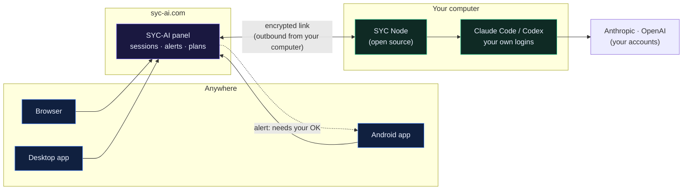

<div align="center">


# SYC-AI

### All You Need With AI — In One.

**Every AI subscription you have — Claude, Codex and more — in one session, one project folder and one memory. On your own computer, steered from the web, your phone or your desktop.**

**English** · [فارسی](README.fa.md) · [中文](README.zh-CN.md) · [Русский](README.ru.md) · [العربية](README.ar.md) · [Español](README.es.md)

[](https://github.com/SYCC-AI/syc-ai/actions/workflows/test.yml)
[](https://github.com/SYCC-AI/syc-ai/releases/latest)
[](LICENSE)
[](#editions)
[](#six-languages)

[**Start free →**](https://app.syc-ai.com/login) &nbsp;·&nbsp; [Get it](#get-started) &nbsp;·&nbsp; [Features](#features) &nbsp;·&nbsp; [How it works](#how-it-works) &nbsp;·&nbsp; [FAQ](#faq)

</div>

<p align="center"></p>

## Why SYC-AI

You pay for Claude **and** ChatGPT, but each one lives in its own terminal, with its own memory, on one machine. When one hits its usage limit in the middle of a task, the work stops. You can't start a session from your phone, and you never know when an agent is waiting for your OK.

**SYC-AI puts all of it in one place.** Connect your computer once. Then open **SYC-AI — All in One**: one session where Claude plans, Codex builds and short questions go to a lighter model — all in the same project folder with the same memory. When one subscription reaches its limit, the next engine picks up the same message and carries on. Your provider logins and your files stay on your own computer.

<p align="center"></p>

## Features

Ranked by what people ask for most when they work with AI coding agents.

| | Feature | What it means for you |
|---|---|---|
| ✨ | **SYC-AI — All in One** | One session for all your engines. Each message goes to the one that suits it — planning to Claude, building to Codex, short questions to a lighter model — or to the one you pick. One project folder and one shared memory (`AGENTS.md`), so nothing is lost when engines take turns. |
| 🔁 | **Your work continues when a limit hits** | When one subscription reaches its usage limit, the same message continues with the next engine in *your* order, with a short handoff of what happened. (SYC-AI never jumps to a second account of the same provider to get around its limit.) |
| 📊 | **All your usage in one place** | The 5-hour and weekly usage of every connected account, with reset times — read without sending anything to a model. |
| 🪙 | **Token saver, on by default** | Short, exact answers and no wasted reading, with credited open-source skills. Their authors measured up to 65% fewer output tokens. |
| 📱 | **Start and steer from your phone** | Open a new session — not just watch one — from the web, the Android app or your desktop. |
| 🔔 | **Phone alerts when an agent needs you** | Your phone tells you when an agent waits for your OK, or when a long task is done. You switch it on; nothing opens by itself. |
| 🧑‍🔧 | **Specialized sessions** | Website builder, bug fixer, code reviewer, research assistant, writer and translator, data analyst, beginner coach, game maker — start one in a click or download it as an `AGENTS.md` for any terminal agent. |
| 👥 | **Two accounts per provider** | A personal and a work login of Claude or Codex on the same device; you choose which one each engine uses. |
| 💻 | **Runs on your own computer** | The AI CLIs install and sign in on your device, under your own accounts. Your logins and your files stay there. |
| ✅ | **You decide what agents may do** | Read only, work in the project, or full access — per session settings, in plain words. |
| ⚡ | **No terminal needed** | One command connects a computer and installs Node.js for you. After that, everything is buttons. |
| 🛡️ | **Open-source device agent** | [SYC Node](node-agent/) only runs the AI CLIs, only touches its own folder, logs every request and can be paused at any time. |
| 🔏 | **Signed updates with rollback** | The panel and SYC Node install only releases signed by SYC, and put the previous version back if a check fails. |
| 🌍 | **Six languages** | English, 中文, Español, العربية, Русский and فارسی — the panel, the installers and the agents' answers. |

**Coming to SYC-AI:** Gemini, Cursor and Kimi inside All in One · connectors with official sign-in (GitHub, Google Drive, Gmail, Notion, Telegram, Figma) · personal image studio · short-video studio · one-click sites and shops · documents and translation · student research desk · game-making workshop · money and finance agents · smart Telegram bots (opt-in audiences only) · a team and company panel · a daily assistant on your phone.

## Get started

One account, four ways in. Sign up at **[app.syc-ai.com](https://app.syc-ai.com/login)** with a Gmail address, a username and a password.

| | Where | How |
|---|---|---|
| 🌐 | **Web** | Open **[app.syc-ai.com](https://app.syc-ai.com/login)** in any browser. |
| 📱 | **Android** | **[Download the SYC-AI app](https://syc-ai.com/download/syc-ai.apk)** (APK). It is the panel on your phone and the link for phone alerts. |
| 🐧 | **Linux / macOS** | `curl -fsSL https://syc-ai.com/node/install.sh \| bash` |
| 🪟 | **Windows** | `irm https://syc-ai.com/node/install.ps1 \| iex` — and in Chrome or Edge, *Install SYC-AI* makes the panel a desktop app. |

Then open **Professional accounts**, press **Install** on Claude or Codex, and **Sign in** once in your own browser. Open **SYC-AI — All in One** and start working.

> The installer adds Node.js if it is missing. Run as root on Linux, it creates a separate `syc-node` user. Remove everything any time with `syc-node uninstall`.

## How it works



- Your computer connects **out** to syc-ai.com. No port is opened on your machine and no server is needed.
- The panel tells SYC Node to start the AI CLI you installed. The CLI talks to Anthropic or OpenAI directly, with your own account.
- Your messages and the agents' replies pass through the panel and are kept in your session history, so you can continue on another device.

## Where your data lives

| Stays on your computer | Kept on syc-ai.com | Your controls |
|---|---|---|
| Your Claude and OpenAI logins (the CLIs keep them) | Your SYC-AI account (email, username, password hash) | `syc-node pause` — the panel can't use the device until you resume |
| Your files and projects | Your session history, so you can continue anywhere | `syc-node log` — every request the panel made to your device |
| The commands the agents run | Device names, alerts, support tickets | `syc-node uninstall` · download your data from your profile |

Full details: [privacy notice](https://syc-ai.com/privacy) · [terms](https://syc-ai.com/terms).

## SYC Node — the agent on your device

SYC Node is a single, dependency-free file ([`node-agent/syc-node.mjs`](node-agent/syc-node.mjs)). It:

- **runs only** the AI CLIs (`claude`, `codex`, `gemini`, `cursor-agent`, `kimi`, `qwen`), npm installs of exactly those packages into `~/.syc-node/npm`, and the official Cursor installer; **it refuses any other program**;
- **reads and writes only inside `~/.syc-node`**; paths outside it are refused;
- **drops any environment variable** that could redirect a CLI to another server or preload code;
- **logs every request** in `~/.syc-node/activity.log` (`syc-node log`);
- **updates itself only** with builds signed by the SYC release key.

```text
syc-node login | run | status | pause | resume | log | update | uninstall
syc-node phone notify|link|text <value>     # what agents use to reach your phone (you choose which kinds)
```

## Six languages

The panel, the installers and the agents' answers speak **English, 中文, Español, العربية, Русский and فارسی**. The README links in your language point to installers that ask *"English or your language?"* when they start.

## Editions

| Edition | Status |
|---|---|
| **SYC-AI (Main)** | Available now — **free during the launch** |
| Plus · Pro · Immortal Edition | Coming. The price is shown before you choose anything; payments are not open yet. |

## Self-host

Prefer to run the whole panel on your own Linux server? The self-hosted edition installs with one command:

```bash
curl -fsSL https://raw.githubusercontent.com/SYCC-AI/syc-ai/main/install.sh | \
  SYC_SRC=https://control.syc-ai.com/install \
  SYC_CONTROL_URL=https://control.syc-ai.com \
  SYC_PUBLIC_ORIGIN=https://<your https origin> \
  SYC_ENTITLEMENT_PUBLIC_KEY_B64=LS0tLS1CRUdJTiBQVUJMSUMgS0VZLS0tLS0KTUNvd0JRWURLMlZ3QXlFQWlKOE1rVHBJTThrdS9WU2ZlalRoNnZFUmE1VEtHai9WY21FUjJCOUlsZ3M9Ci0tLS0tRU5EIFBVQkxJQyBLRVktLS0tLQo= \
  SYC_RELEASE_PUBLIC_KEY_B64=LS0tLS1CRUdJTiBQVUJMSUMgS0VZLS0tLS0KTUNvd0JRWURLMlZ3QXlFQXcxK3prU0RTdkovWEdpbFhpRmFONXpJRVRLcWJndVh5U2g0VjVpeU9IZXM9Ci0tLS0tRU5EIFBVQkxJQyBLRVktLS0tLQo= \
  SYC_ARTIFACT_SRC=https://control.syc-ai.com/artifacts \
  SYC_ARTIFACT_ACCESS=grant \
  bash
```

Needs Linux with systemd, Node.js 20+, `zstd`, `curl`, `tar`, root access and an HTTPS reverse proxy. The installer is fail-closed: without the signed manifest and both public keys it stops before touching your server. Upgrades keep your data; a failed update puts the previous version back. `sudo /opt/syc-ai/manage-installation.sh repair|uninstall` repairs or removes it (user data is never silently erased).

## FAQ

<details><summary><b>Is it free?</b></summary>

SYC-AI (Main) is free during the launch. Paid editions come later; their price is shown before you choose, and payments are not open yet.
</details>

<details><summary><b>Do I need a server?</b></summary>

No. Your own laptop or PC is enough. A server works too, if you want your agents to run there.
</details>

<details><summary><b>Is my code sent to you?</b></summary>

Your files stay on your computer. The conversation — your messages and the agents' replies, which can quote parts of files — passes through syc-ai.com and is kept in your session history.
</details>

<details><summary><b>What can SYC Node do on my computer?</b></summary>

Only start the AI CLIs, install exactly those CLIs with npm, and read or write inside `~/.syc-node`. Everything else is refused and logged. You can pause it or remove it at any time. [Read the code](node-agent/syc-node.mjs).
</details>

<details><summary><b>Does SYC-AI get around the usage limits of my subscriptions?</b></summary>

No. Each engine runs under your own account and its own limits. When one subscription reaches its limit, SYC-AI can continue the same work with a *different* engine you also pay for (for example Codex after Claude). It never rotates between several accounts of the same provider to get around a limit.
</details>

<details><summary><b>Is SYC-AI affiliated with Anthropic, OpenAI or Google?</b></summary>

No. SYC-AI is an independent product. You use your own accounts with each provider, under that provider's terms. Claude, Codex, Gemini, Cursor and Kimi are trademarks of their owners.
</details>

## Security

Releases and SYC Node updates are Ed25519-signed; the panel verifies size and SHA-256 before it writes a byte, applies updates transactionally and rolls back on failure. Sessions use secure cookies and CSRF protection; passwords are hashed with scrypt; device tokens are stored only as hashes. Report a vulnerability privately: [SECURITY.md](SECURITY.md).

## Community

- Questions and ideas: [Discussions](https://github.com/SYCC-AI/syc-ai/discussions)
- Bugs: [Issues](https://github.com/SYCC-AI/syc-ai/issues)
- Email: syc@syc-ai.com

If SYC-AI makes your work easier, a ⭐ helps other people find it.

## Thanks

SYC-AI's token saver is built on open-source work, credited inside the product wherever it is used:
[Caveman](https://github.com/JuliusBrussee/caveman) by Julius Brussee (MIT) and the
[Superpowers](https://github.com/obra/superpowers) skills by Jesse Vincent (MIT).
Their licenses ship with the skills in [`skills/`](skills/).

## License

Source-available under the [Business Source License 1.1](LICENSE). `SYC` and `SYC-AI` are trademarks of SYC. SYC-AI is not affiliated with Anthropic, OpenAI, Google, Cursor or Moonshot AI.
