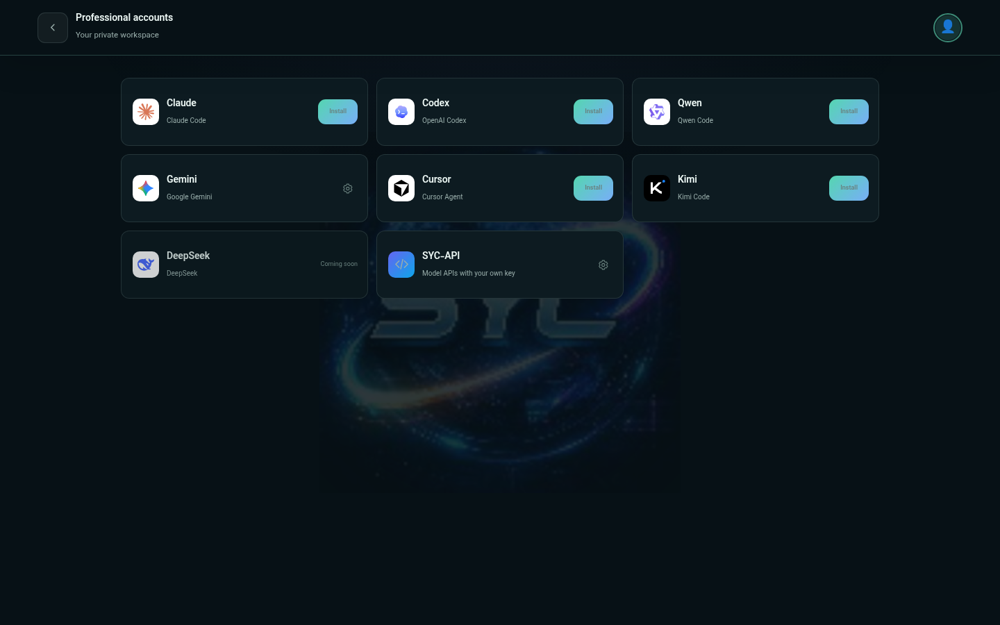
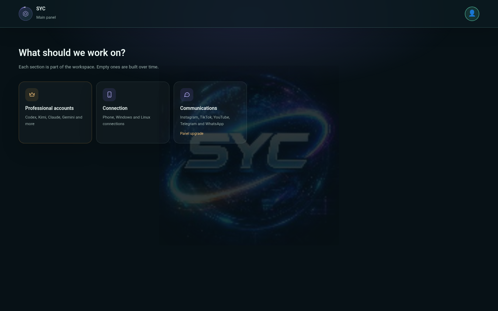
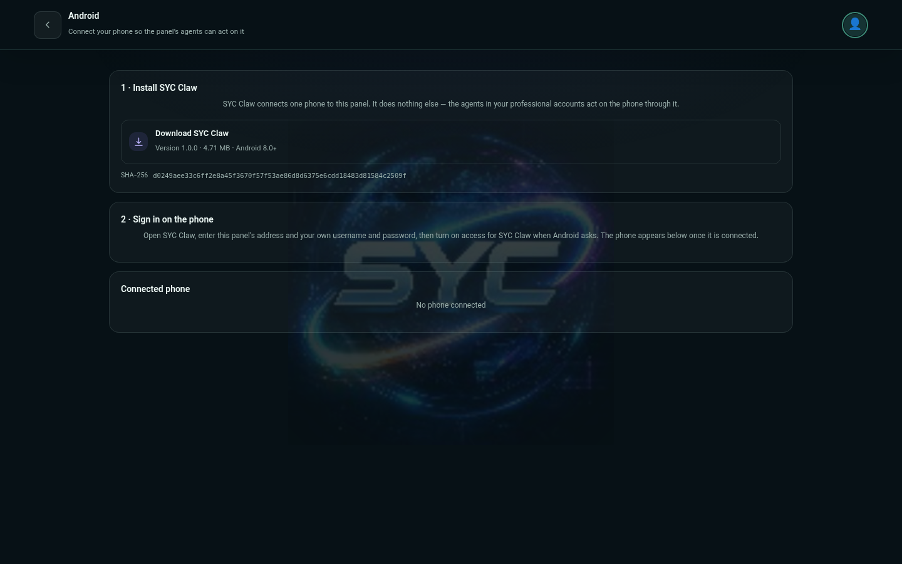

<div align="center">


# SYC-AI

**Every AI account you own. One panel. Your server.**

Stop switching between Claude, Codex, Gemini, Cursor, Kimi and three ChatGPT
logins. Sign in once, work with all of them side by side — and let your agents
reach your phone, your servers and your channels.

[](LICENSE)
[](#requirements)
[](#security)
[](#languages)
[](#editions)

[Install](#install) · [What you get](#what-you-get-today) · [Editions](#editions) · [Security](#security) · [Support](#support)

</div>

<p align="center"></p>

---

## Tired of switching?

Codex for one job. Claude for the next. Gemini for a third, Cursor for the rest
— and a handful of ChatGPT accounts you keep logging in and out of because each
one hits its limit at a different hour.

**SYC-AI is the answer to that.** Install it once on your own server, sign in to
your accounts once, and run every account, every model and every agent from a
single panel that is yours.

And that is only the beginning.

## What you get today

**SYC-AI (Main)** — free for everyone until **14 October 2026**.

- **Every account in one place.** Claude, Codex, Gemini, Qwen, Cursor, Kimi and
  API-key providers, each in its own panel, all behind one sign-in.
- **Your agents in your pocket.** Pair your Android phone with the **SYC Claw**
  app in minutes. The panel hands you the app; you sign in on the phone; your
  agents can act on it — with permissions *you* switch on, one by one.
- **Your server, your data.** Self-hosted. Nothing leaves your machine except
  your own requests to your own providers.
- **Updates you can trust.** Every release is signed. The panel verifies hash
  and size before it writes a byte, applies the update transactionally,
  health-checks itself and rolls back on failure. Your data survives either way.
- **A real account, not a local password.** Central sign-up, username and
  password recovery, signed entitlements — and no second factor forced on you.
  Extra security lives in settings, never at the door.
- **Support inside the panel.** Tickets and announcements where you work.
- **Six interface languages.** English, 中文, Español, العربية, Русский, فارسی.

<p align="center">
&nbsp;

</p>

## And that is only the beginning

Main is the front door. Behind it, SYC-AI already does this — the professional
editions bring it to you:

- **Every server, one mesh.** Link all your servers and let your agents work
  across them as one.
- **Your channels, your agents.** Connect the social platforms and services you
  already use to the agents on your accounts.
- **Agents that spend less.** Token saving built into the agent itself —
  nothing extra to install.
- **Agents that think your way.** Personal configuration for how each agent
  reasons, sees and answers.
- **Agent Surgery.** For professionals who need to see exactly what an agent is
  doing — and change it.

You are a professional; the next editions are built for you. Until then, Main
is free. Install it and find out how much easier your monthly accounts were
supposed to be.

## Install

One command on a fresh Linux server:

```bash
curl -fsSL https://raw.githubusercontent.com/SYCC-AI/syc-ai/main/install.sh | \
  SYC_SRC=https://control.syc-ai.com/install \
  SYC_CONTROL_URL=https://control.syc-ai.com \
  SYC_PUBLIC_ORIGIN=https://<your https origin> \
  SYC_ENTITLEMENT_PUBLIC_KEY_B64=LS0tLS1CRUdJTiBQVUJMSUMgS0VZLS0tLS0KTUNvd0JRWURLMlZ3QXlFQWlKOE1rVHBJTThrdS9WU2ZlalRoNnZFUmE1VEtHai9WY21FUjJCOUlsZ3M9Ci0tLS0tRU5EIFBVQkxJQyBLRVktLS0tLQo= \
  SYC_RELEASE_PUBLIC_KEY_B64=LS0tLS1CRUdJTiBQVUJMSUMgS0VZLS0tLS0KTUNvd0JRWURLMlZ3QXlFQXcxK3prU0RTdkovWEdpbFhpRmFONXpJRVRLcWJndVh5U2g0VjVpeU9IZXM9Ci0tLS0tRU5EIFBVQkxJQyBLRVktLS0tLQo= \
  SYC_ARTIFACT_SRC=https://control.syc-ai.com/artifacts \
  SYC_ARTIFACT_ACCESS=grant \
  bash
```

Then open your origin, create your account and pick **Main**. Add
`SYC_FLAVOR=full` to ship Claude and Codex in the same download, and
`SYC_YES=1` to skip the prompts on an unattended server.

The installer is deliberately fail-closed: it needs the signed release manifest,
the release and entitlement public keys and an HTTPS control URL, or it stops
before touching your server. Upgrades keep your data; a failed activation puts
the previous installation back.

### Requirements

- Linux with `systemd`
- Node.js 20 or newer
- `zstd`, `curl` and `tar`
- root access for service installation
- an HTTPS reverse proxy (nginx, Caddy) in front of the panel

## Editions

| Edition | Status | Price |
|---|---|---|
| **SYC-AI (Main)** | available now | ~~1.75 USDT~~ **free until 14 October 2026** |
| Plus | next | — |
| Pro | next | — |
| Immortal Edition | next | — |

The launch offer runs for 22 days from release day (22 September → 14 October
2026). After that, Main is 1.75 USDT — the panel shows the exact end date on
its plan page.

Professional accounts are delivered only against a short-lived, single-use
grant bound to your installation — never from a public download.

## Security

- Release and entitlement documents are verified before use; the release key
  never leaves SYC.
- Central sessions use secure cookies, CSRF protection, step-up checks and
  role-based authorization.
- Runtime secrets live outside the release archives, owner-readable only.
- Backups are authenticated and encrypted; restores validate before activation.
- A release the panel cannot apply leaves it in **restricted mode**: account and
  support stay reachable, nothing is silently out of date, nothing is deleted.
- The phone app connects by signing in to *your* panel; every capability starts
  off and is switched on by you.

Private reporting: see [SECURITY.md](SECURITY.md).

## Operations

```bash
sudo /opt/syc-ai/manage-installation.sh repair
sudo /opt/syc-ai/manage-installation.sh uninstall
```

Uninstall is recoverable: the installation is moved to a timestamped backup and
only its own service units are removed. User data is never silently erased.
Migration from the earlier `syc-free` service is handled by the installer.

## Languages

English (default), 中文, Español, العربية, Русский and فارسی. Other
languages for this page are on the way.

## Support

Open an issue on [github.com/SYCC-AI/syc-ai](https://github.com/SYCC-AI/syc-ai/issues). Inside the panel, use **Support** to open a
ticket that reaches the operators directly.

## License

Source-available under the Business Source License 1.1 — see [LICENSE](LICENSE)
for the use grant and change date. `SYC` and `SYC-AI` are trademarks of SYC.
