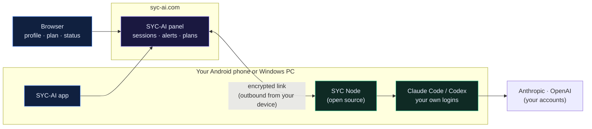

# SYC-AI

### Claude Code and Codex in one conversation. When one hits its limit, the other picks up.

Same project folder, same memory: your own two subscriptions, on your own Android phone or Windows PC. 
In six languages.

**English** · [فارسی](README.fa.md) · [中文](README.zh-CN.md) · [Русский](README.ru.md) · [العربية](README.ar.md) · [Español](README.es.md)

- **New: Free Professional — free for everyone.** No subscription, no API key.
  - About 60 free AI models in one coding session, tested and ranked every day. It starts on the strongest; when a free quota runs out, the next model carries on in the same files.
  - Pick any model yourself, or let Claude or Codex write only the plan while free models do the work, with live "step 3 of 8" progress. [How it works →](https://syc-ai.com/free-professional/)
- **One conversation, two engines.**
  - Claude plans, Codex builds, and quick questions go to a lighter model, all in one folder with one shared `AGENTS.md`.
  - When a subscription reaches its limit, the same message continues on your *other* engine, with a short handoff of what it missed.
  - It never switches to a second account of the same provider.
- **Nothing to set up by hand.**
  - The Android app and the Windows app come with Claude Code and Codex.
  - The device joins your account with a code you approve, or by itself on your phone.
  - You sign in to Claude and Codex yourself, in your own browser.
- **See what you spend.**
  - 5-hour and weekly usage of every account.
  - A token doctor.
  - A warning before you reopen an expensive "cold" conversation.
  - All computed without asking a model.

**Get it:** [sign up free](https://app.syc-ai.com/login) (Google, GitHub or Gmail) → Android: [**syc-ai.apk**](https://syc-ai.com/download/syc-ai.apk) · Windows: [**SYC-AI-Setup.exe**](https://syc-ai.com/download/SYC-AI-Setup.exe)

SYC-AI is an independent product by SYC, not affiliated with Anthropic or OpenAI. You use your own accounts under each provider's terms. The official, unmodified CLIs run on your device.

## Features

| | Feature | What it means for you |
|---|---|---|
| ✨ | **SYC-AI — All in One** | One session for Claude and Codex. Each message goes to the one that suits it — planning to Claude, building to Codex, short questions to a lighter model — or to the one you pick. One project folder and one shared memory (`AGENTS.md`), so nothing is lost when engines take turns. |
| 🆓 | **Free Professional — free for everyone** | About 60 free AI models, tested and ranked every day, in one coding session on your device: the strongest starts, and when its free quota runs out the next one carries on. Pick any model yourself, or let Claude or Codex write only the plan while free models build it step by step. No subscription and no API key; fair use 800 requests a day. |
| 🔁 | **Your work continues when a limit hits** | When one subscription reaches its usage limit, the same message continues with the next engine in *your* order, with a short handoff of what happened. (SYC-AI never jumps to a second account of the same provider to get around its limit.) |
| 📊 | **All your usage in one place** | The 5-hour and weekly usage of every connected account, with reset times — read without sending anything to a model. |
| 🩺 | **Token doctor and cold-conversation warning** | A checkup of how your conversations spend tokens, in Claude and in Codex — cache hits, conversations whose cache has expired, the fixed part of every question — with plain advice. Before you continue a long conversation after an hour or more, SYC-AI warns you that the next message would re-read all of it at full price. Nothing here asks a model. |
| 🪙 | **Token saver, on by default** | Short, exact answers and no wasted reading, with credited open-source skills (Caveman, Superpowers). |
| 📱 | **Android app with Claude Code and Codex inside** | The agents run on the phone itself. On first start the app sets up the official, unmodified CLIs in a private space and connects the phone to your account. Sign in with Google or GitHub inside the app. |
| 🪟 | **Windows app with Claude Code and Codex inside** | One Setup.exe, no administrator rights: Node.js, SYC Node, Claude Code and Codex in one download. The computer joins your account with a code you approve — no SYC-AI password is typed on the device. |
| 🔔 | **Alerts when an agent needs you** | Your phone tells you when an agent waits for your OK, or when a long task is done. You switch it on; nothing opens by itself. |
| 🧑‍🔧 | **Specialized sessions** | Website builder, bug fixer, code reviewer, research assistant, writer and translator, data analyst, beginner coach, game maker — start one in a click or download it as an `AGENTS.md` for any terminal agent. |
| 👥 | **Two accounts per provider** | A personal and a work login of Claude or Codex on the same device; you choose which one each engine uses. |
| ✅ | **You decide what agents may do** | Read only, work in the project, or full access — per session settings, in plain words. |
| 🛡️ | **Open-source device agent** | [SYC Node](node-agent/) only runs the AI CLIs, only touches its own folder, logs every request and can be paused at any time. SYC-AI's own settings files on your device are signed, and a changed one is put back. |
| 🔏 | **Signed updates with rollback** | The panel and SYC Node install only releases signed by SYC, and put the previous version back if a check fails. |
| 🌍 | **Six languages** | English, 中文, Español, العربية, Русский and فارسی — the panel, the apps and the agents' answers. |

**Engines today:** Claude Code and Codex are tested and work in every session. You can already sign in to Gemini, Cursor and Kimi on your device; their chat panel is coming. Qwen is coming.

## Honest comparison

| | **SYC-AI** | Anthropic Remote Control | Happy | Paseo | CloudCLI |
|---|---|---|---|---|---|
| Agents | Claude Code + Codex (Gemini, Cursor, Kimi: sign-in available, chat coming) | Claude Code | Claude Code, Codex | Claude Code, Codex, Copilot, OpenCode, Pi | Claude Code, Cursor CLI, Codex |
| One conversation shared by two engines, same memory | **Yes** (All in One) | — (one engine) | Not advertised | Not advertised (one interface, separate agents) | Not advertised |
| Continues on another engine when a subscription hits its limit | **Yes**, a different provider only, never a second account of the same one | — | Not advertised | Not advertised | Not advertised |
| Installs the agent CLIs for you | **Yes** (inside the Android and Windows apps) | You install Claude Code | You install the CLI, then `npm i -g happy` | CLI is a prerequisite | Uses your existing CLI sessions |
| Phone | Android app (APK) that runs Claude Code + Codex on the phone. No iOS yet | Claude app, iOS + Android | iOS, Android, web | iOS, Android | Browser |
| Alert when an agent needs you | Yes (opt-in) | Yes (push) | Yes (push) | Not stated in README | Not stated in README |
| Where the conversation passes | syc-ai.com (kept in your session history; not end-to-end encrypted) | Anthropic | End-to-end encrypted relay | Your daemon; optional E2E relay | Your machine (or their Cloud) |
| Account needed | Yes (Google, GitHub or Gmail) | Claude subscription | — | No forced log-ins | No (self-hosted) |
| Licence | BSL 1.1 (source-available; SYC Node source in repo) | Proprietary | MIT | Apache-2.0 | AGPL-3.0 |
| Price | Main free until 31 Dec 2026, then 1.75 USD/month | Included in Claude plans | Free | Free | Free self-hosted; Cloud from €7/month |

"Not advertised" means the project's README (read on 2026-09-25) does not say it; it does not mean the feature is impossible. Corrections are welcome in [Issues](https://github.com/SYCC-AI/syc-ai/issues).

## Get started

1. **Sign up** at **[app.syc-ai.com](https://app.syc-ai.com/login)** with Google, GitHub, or a Gmail address and a password. SYC-AI accounts are Gmail-based: to use GitHub, your GitHub account needs a verified Gmail address.
2. **Get the app:**

   | | Where | How |
   |---|---|---|
   | 📱 | **Android** | **[Download syc-ai.apk](https://syc-ai.com/download/syc-ai.apk)** (not on Google Play yet; Android allows the install after you confirm it). Open it and sign in. On first start it sets up Claude Code and Codex on the phone — a few minutes — and connects the phone to your account by itself. |
   | 🪟 | **Windows (x64)** | **[Download SYC-AI-Setup.exe](https://syc-ai.com/download/SYC-AI-Setup.exe)** and run it. No administrator rights needed. It shows a short code and a link: open the link wherever you are signed in — on the computer or on your phone — and press **Connect this device** within 10 minutes. |
   | 🌐 | **Web** | **[app.syc-ai.com](https://app.syc-ai.com/login)** in any browser shows your profile, your plan and the status of your devices. To connect Claude and Codex you need the Android or Windows app. |

3. **Sign in to Claude and Codex.** In **Professional accounts**, press **Sign in** on each engine and sign in once, in your own browser. Then open **SYC-AI — All in One** and start working.

> The Windows Setup.exe is not code-signed yet, so Windows SmartScreen may ask you to confirm (**More info → Run anyway**). Remove it any time from **Apps & features**.

## How it works

```mermaid
flowchart LR
  W["Browser<br/>profile · plan · status"]:::c
  subgraph dev["Your Android phone or Windows PC"]
    A["SYC-AI app"]:::c
    N["SYC Node<br/>(open source)"]:::n
    C["Claude Code / Codex<br/>your own logins"]:::n
  end
  subgraph cloud["syc-ai.com"]
    P["SYC-AI panel<br/>sessions · alerts · plans"]:::s
  end
  W & A --> P
  P <-- "encrypted link<br/>(outbound from your device)" --> N
  N --> C
  C --> AI["Anthropic · OpenAI<br/>(your accounts)"]
  classDef c fill:#10203f,stroke:#4f8cff,color:#eaf0ff
  classDef s fill:#1a1840,stroke:#8b7bff,color:#eaf0ff
  classDef n fill:#0f2a24,stroke:#34d399,color:#eaf0ff
```

- Your device connects **out** to syc-ai.com. No port is opened on it and no server is needed ([read the agent's code](node-agent/syc-node.mjs)).
- The panel tells SYC Node to start the AI CLI installed on your device. The CLI talks to Anthropic or OpenAI directly, with your own account.
- Your messages and the agents' replies pass through the panel and are kept in your session history, so you can continue on another device. They are not end-to-end encrypted.

## Where your data lives

| Stays on your device | Kept on syc-ai.com | Your controls |
|---|---|---|
| Your Claude and OpenAI logins (the CLIs keep them) | Your SYC-AI account (email, username, password hash) | Pause SYC Node — the panel can't use the device until you resume |
| Your files and projects | Your session history, so you can continue anywhere | The activity log — every request the panel made to your device |
| The commands the agents run | Device names, alerts, support tickets | Uninstall at any time · download your data from your profile |

Full details: [privacy notice](https://syc-ai.com/privacy) · [terms](https://syc-ai.com/terms).

## SYC Node — the agent on your device

SYC Node is a single, dependency-free file ([`node-agent/syc-node.mjs`](node-agent/syc-node.mjs)) inside the Android and Windows apps. It:

- **runs only** the AI CLIs (`claude`, `codex`, `gemini`, `cursor-agent`, `kimi`, `qwen`), npm installs of exactly those packages into `~/.syc-node/npm`, and the official Cursor installer; **it refuses any other program**;
- **reads and writes only inside `~/.syc-node`**; paths outside it are refused;
- **drops any environment variable** that could redirect a CLI to another server or preload code;
- **checks the signature** of every SYC-AI settings file it writes, and puts back a file that was changed;
- **logs every request** in `~/.syc-node/activity.log`;
- **updates itself only** with builds signed by the SYC release key.

## Six languages

The panel, the apps and the agents' answers speak **English, 中文, Español, العربية, Русский and فارسی**. The apps follow the language of your phone or of Windows.

## Editions

| Edition | Status |
|---|---|
| **SYC-AI (Main)** | Available now — **free until 31 December 2026**, then 1.75 USD a month |
| Plus · Pro · Immortal Edition | Coming soon (4, 15 and 90 USD a month). The price is shown before you choose anything; payments are not open yet. |

## Coming soon

Gemini, Cursor, Kimi and Qwen chat inside SYC-AI · connectors with official sign-in (GitHub, Google Drive, Gmail, Notion, Telegram, Figma) · personal image studio · short-video studio · one-click sites and shops · documents and translation · student research desk · game-making workshop · money and finance agents · smart Telegram bots (opt-in audiences only) · a team and company panel · a daily assistant on your phone.

## FAQ

<b>Is it free?</b>

SYC-AI (Main) is free until 31 December 2026; after that it costs 1.75 USD a month. Paid editions come later; their price is shown before you choose, and payments are not open yet.

<b>Do I need a server?</b>

No. Your Android phone or your Windows PC is enough.

<b>Do I need to install Claude Code or Codex first?</b>

No. Both come inside the Android app and the Windows app. You only sign in to your own Claude and ChatGPT accounts, once, from the panel.

<b>What can I do in the browser?</b>

The web panel shows your profile, your plan and upgrades, and the status of your devices. Working with Claude and Codex needs the Android or Windows app, because the agents run on your device.

<b>Is my code sent to you?</b>

Your files stay on your device. The conversation — your messages and the agents' replies, which can quote parts of files — passes through syc-ai.com and is kept in your session history.

<b>What can SYC Node do on my device?</b>

Only start the AI CLIs, install exactly those CLIs with npm, and read or write inside `~/.syc-node`. Everything else is refused and logged. You can pause it or remove it at any time. [Read the code](node-agent/syc-node.mjs).

<b>Does SYC-AI get around the usage limits of my subscriptions?</b>

No. Each engine runs under your own account and its own limits. When one subscription reaches its limit, SYC-AI can continue the same work with a *different* engine you also pay for (for example Codex after Claude). It never rotates between several accounts of the same provider to get around a limit.

<b>Is there an iPhone, Mac or Linux version?</b>

No. SYC-AI runs on Android and Windows. On any other device the web panel shows your profile, plan and devices.

<b>Is SYC-AI affiliated with Anthropic, OpenAI or Google?</b>

No. SYC-AI is an independent product. You use your own accounts with each provider, under that provider's terms. Claude, Codex, Gemini, Cursor, Kimi and Qwen are trademarks of their owners.

## Self-host

Organisations that want to run the whole panel on their own server can ask for the self-hosted edition at syc@syc-ai.com.

## Security

Releases and SYC Node updates are Ed25519-signed; the panel verifies size and SHA-256 before it writes a byte, applies updates transactionally and rolls back on failure. Sessions use secure cookies and CSRF protection; passwords are hashed with scrypt; device tokens are stored only as hashes. Report a vulnerability privately: [SECURITY.md](SECURITY.md).

## Community

- Questions and ideas: [Discussions](https://github.com/SYCC-AI/syc-ai/discussions)
- Bugs: [Issues](https://github.com/SYCC-AI/syc-ai/issues)
- Email: syc@syc-ai.com

If SYC-AI makes your work easier, a ⭐ helps other people find it.

## Thanks

SYC-AI's token saver is built on open-source work, credited inside the product wherever it is used:
the [Caveman](https://github.com/JuliusBrussee/caveman) skill by Julius Brussee (the skill only, MIT) and the
[Superpowers](https://github.com/obra/superpowers) skills by Jesse Vincent (MIT).
Their licenses ship with the skills in [`skills/`](skills/).

## License

Source-available under the [Business Source License 1.1](LICENSE). `SYC` and `SYC-AI` are trademarks of SYC. SYC-AI is not affiliated with Anthropic, OpenAI, Google, Cursor, Moonshot AI or Alibaba.
